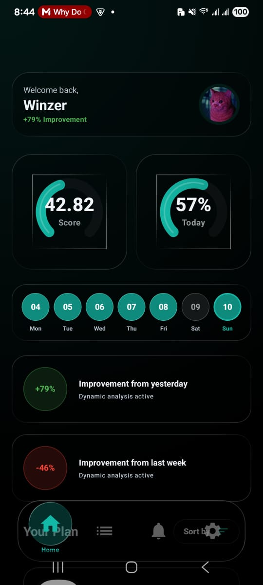
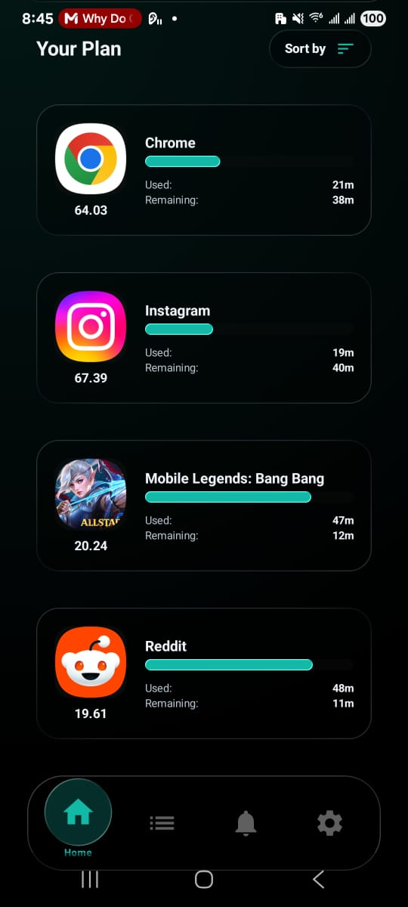
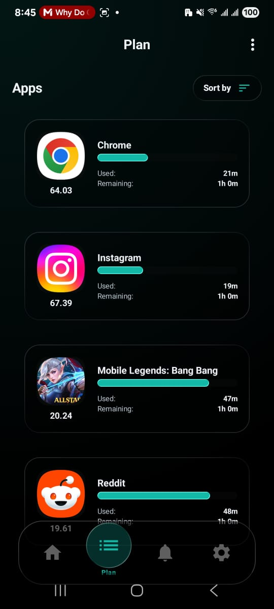
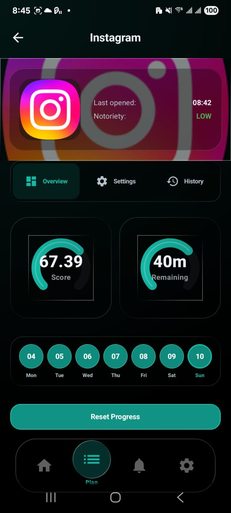
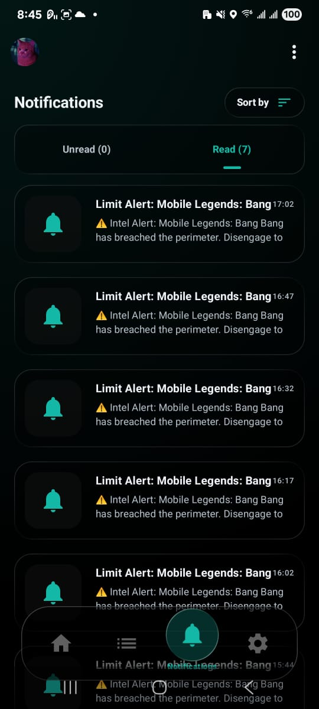
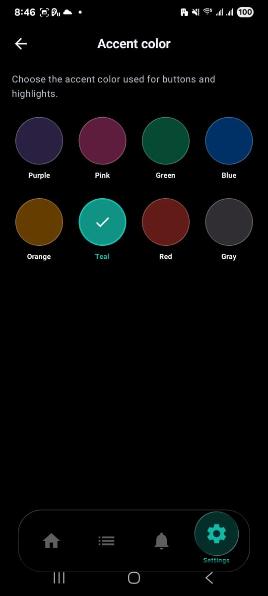
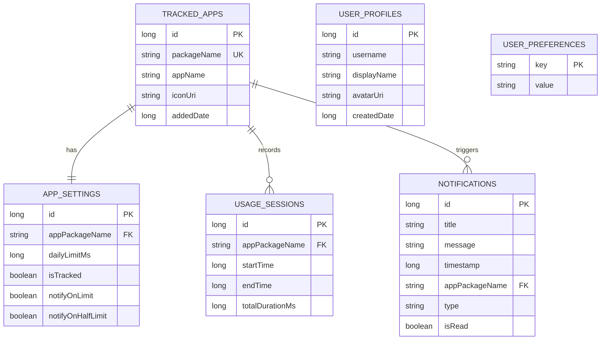
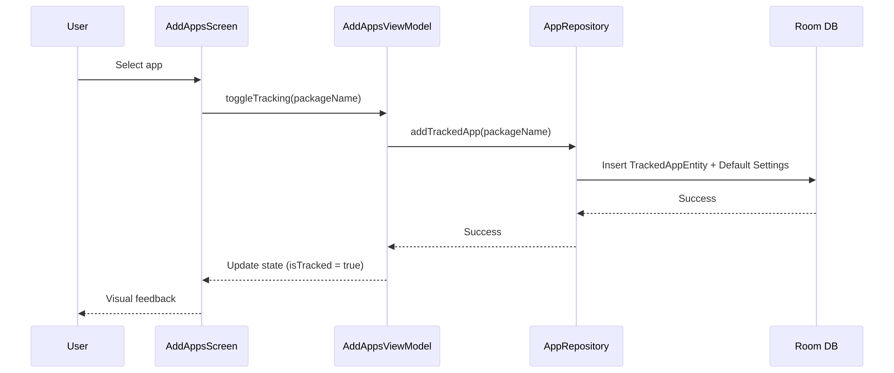
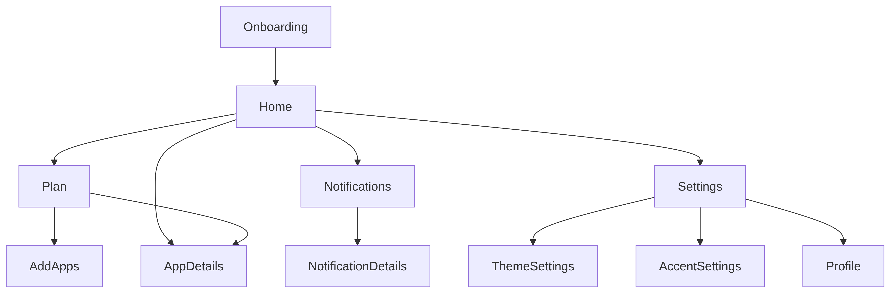

# Aion  
> Reclaim Your Time

Aion is a time-management application designed to help you monitor and control your app usage, set healthy boundaries, and regain focus through good design, gamification and insights.

## Main Goal
The primary objective of Aion is to empower users to become more conscious of their digital habits. By providing beautiful, intuitive data visualizations, customizable limits as well as gamification and online features, Aion helps reduce screen time and improve productivity without sacrificing aesthetic appeal.

---

## Features & Screens

### Home Overview
Your central dashboard showing your daily focus score, improvement trends, and current streaks.

*Available in various accent colors and pure black dark mode.*

### Progress & Stats
Track your usage with high-fidelity UI components like glass gauges and animated stat cards.

### 🗓Smart Planning
Add apps to your tracking plan and set individual daily limits with a simple interface.

### Detailed Analysis
Dive deep into your history for any specific app to see patterns and notoriety.

### Smart Notifications
Stay informed with real-time alerts when you're approaching or exceeding your limits.

### Personalization
Choose from a wide range of accent colors and toggle between pure black dark mode or clean light mode.

---

## How It Works

### Database Architecture
Aion uses a robust local database to keep your data private and secure.

### App Tracking Flow
Adding an app to your plan is a seamless process.

### Screen Navigation
Aion's intuitive hierarchy makes navigation fluid and simple.

---
*Built with Jetpack Compose and the Backdrop Glassmorphism library.*
