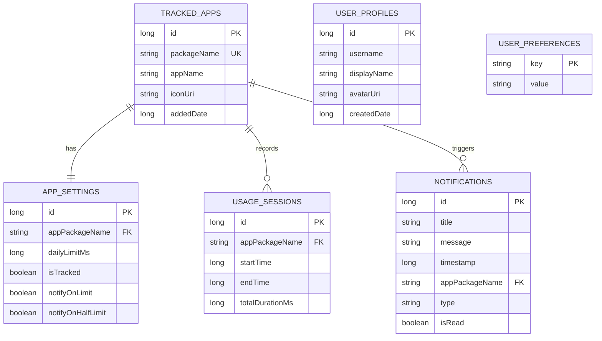
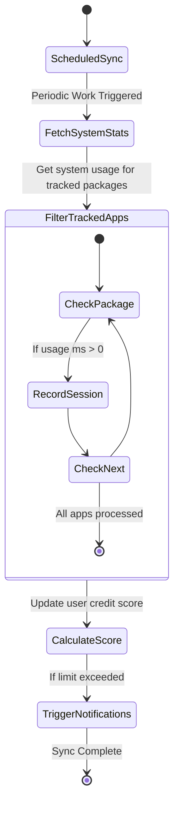
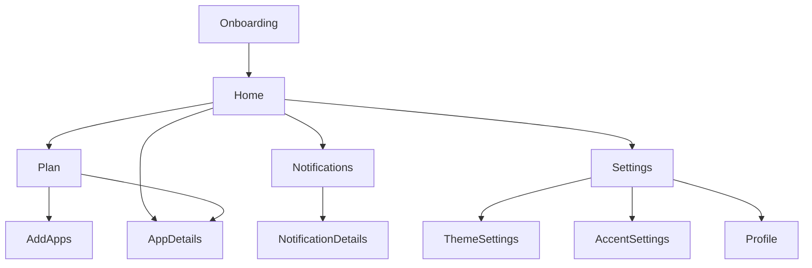

# Aion System Architecture Documentation

This document provides a detailed overview of the Aion application's architecture, database schema, and core workflows.

## 1. System Architecture Overview

Aion follows the **Modern Android Architecture** guidelines, utilizing a layered approach with **Clean Architecture** principles and the **MVVM (Model-View-ViewModel)** pattern.

### Layers:
1.  **UI Layer (Presentation)**:
    *   **Composables**: Jetpack Compose based UI components and screens.
    *   **ViewModels**: Manage UI state and handle user interactions, communicating with the Data layer.
2.  **Domain Layer (Optional/Implicit)**:
    *   Currently integrated into the Data/UI layer for simplicity, but utilizes **ScoringEngine** and **TimeUtils** as business logic utilities.
3.  **Data Layer**:
    *   **Repositories**: Abstract data sources (Local Room DB, System Usage Stats).
    *   **DAOs**: Data Access Objects for Room database.
    *   **Entities**: Database table definitions.
    *   **WorkManager**: Handles background tasks like usage synchronization.

---

## 2. Database Schema (Room)

Aion uses a local SQLite database managed by the Room persistence library.

### Entities:
*   `tracked_apps`: Apps explicitly added by the user for monitoring.
*   `app_settings`: User-defined limits and notification preferences for each tracked app.
*   `usage_sessions`: Recorded historical usage data.
*   `notifications`: History of alerts triggered by the system.
*   `user_profiles`: Basic user identification.
*   `user_preferences`: Key-value pairs for app-wide settings (theme, accent color).

---

## 3. Entity Relationship Diagram (ERD)



---

## 4. Sequence Diagram: App Tracking Flow

This diagram illustrates the flow when a user adds a new app to their tracking plan.

```mermaid
sequenceDiagram
    participant User
    parameter UI as AddAppsScreen
    participant VM as AddAppsViewModel
    participant Repo as AppRepository
    participant DB as Room Database

    User->>UI: Select App to track
    UI->>VM: toggleTracking(packageName)
    VM->>Repo: addTrackedApp(entity)
    Repo->>DB: Insert TrackedAppEntity
    DB-->>Repo: Success
    Repo->>DB: Insert Default AppSettings
    DB-->>Repo: Success
    Repo-->>VM: Done
    VM-->>UI: Update UI State (isTracked = true)
    UI-->>User: Visual Confirmation (Glass Checkbox)
```

---

## 5. Activity Diagram: Daily Usage Sync

This diagram shows the background process managed by WorkManager to synchronize usage data.



---

## 6. UI Navigation Architecture

The app uses a single-activity architecture with **Compose Navigation**.



---

## 7. Component Architecture: Liquid Glass

Aion implements a custom "Liquid Glass" design system built on top of the `Backdrop` library.

*   **Base**: `GlassCard.kt` providing blur, refraction (lens), and dynamic shadows.
*   **Interaction**: `AionGlassSwitch` and `AionGlassMenu` replace standard Material 3 components.
*   **Feedback**: Fluid `NavHost` transitions and spring-based animations for data visualization.
