# Enaf System Architecture (Unified Target State)

This document is the single high-level blueprint for the full application, from app launch to authenticated usage flows.

## 1) System Scope
- Platform: Android, Jetpack Compose.
- App phases: onboarding, authentication, main productivity shell.
- Main tabs: home, planner, insights, settings.
- Architecture style: layered MVVM + repository + local-first storage.

## 2) Layered Architecture
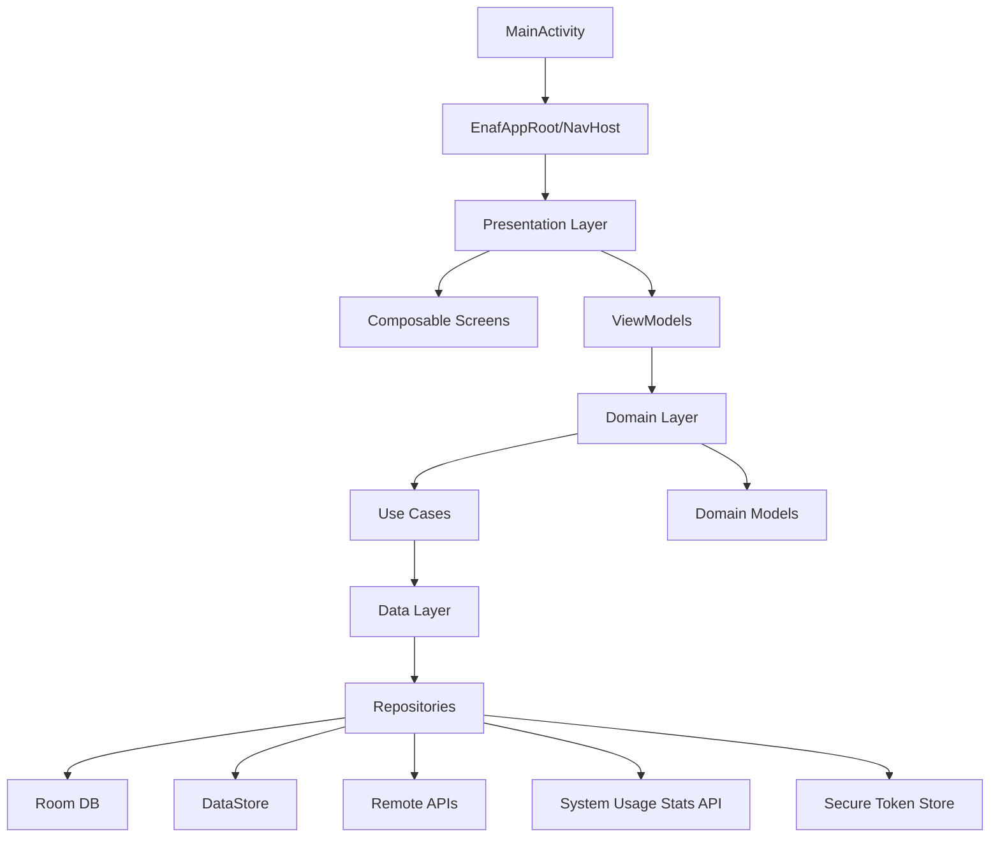

## 3) Core Class Diagram
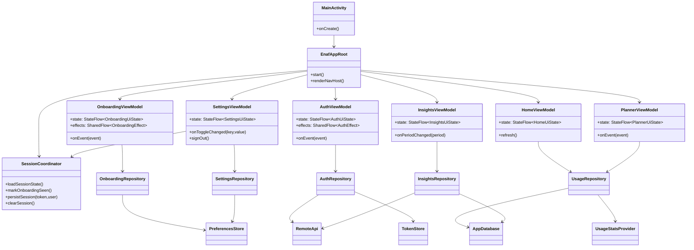

## 4) End-to-End Sequence Diagram
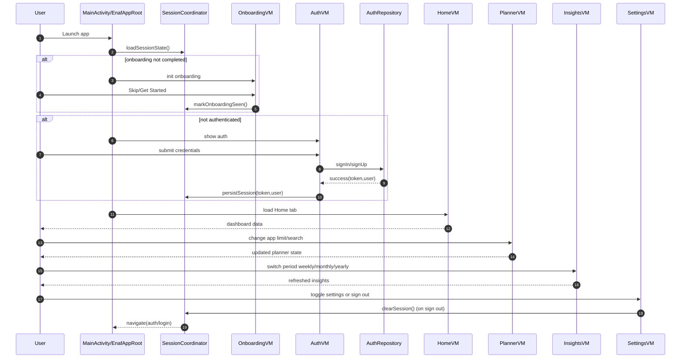

## 5) Activity Diagram: App Startup and Routing
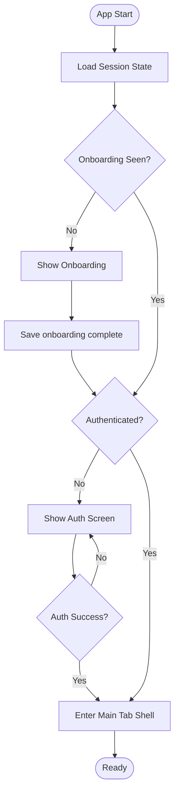

## 6) Activity Diagram: Planner Limit Update
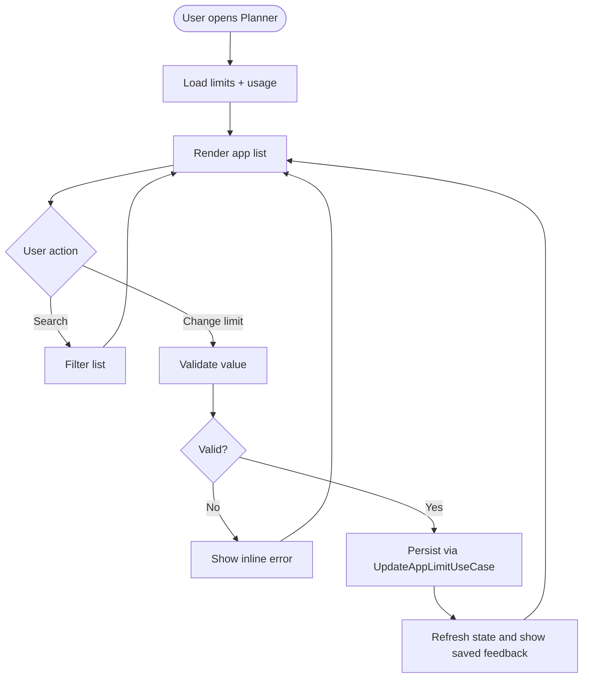

## 7) Activity Diagram: Settings and Sign-out
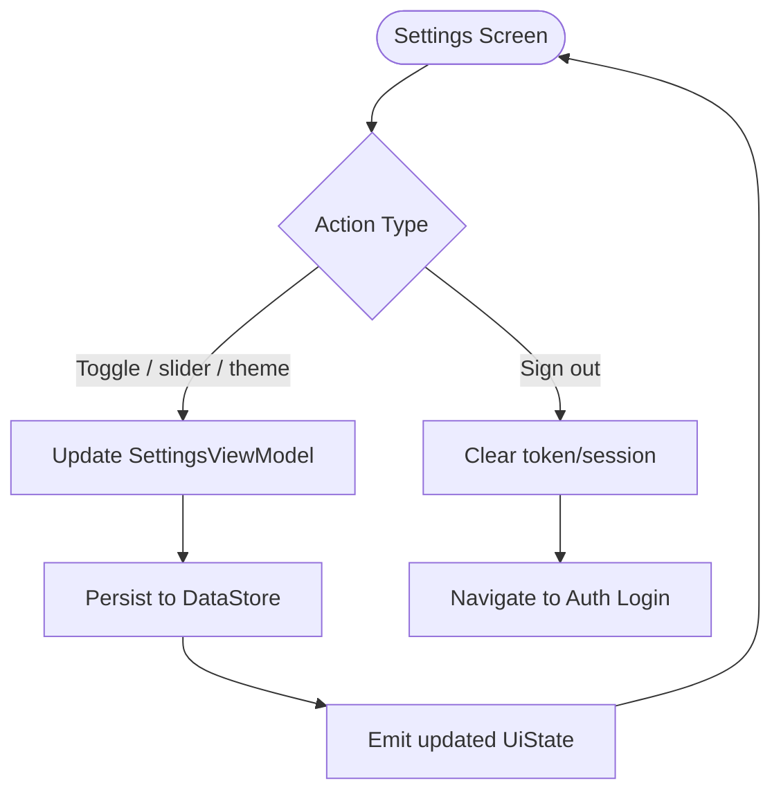

## 8) Navigation Graph (Target)
- `onboarding`
- `auth/login`
- `auth/signup`
- `main/home`
- `main/planner`
- `main/insights`
- `main/settings`
- Optional overlays: `times_up_modal`, `profile`, `notifications`

## 9) State Ownership Rules
- Composables render from `UiState` and dispatch `UiEvent` only.
- ViewModels own business-relevant screen state.
- Repositories are the only data source abstraction used by ViewModels.
- Session state (onboarding + auth) is centralized in `SessionCoordinator`.

## 10) Delivery Order
1. Replace direct tab switching in `EnafApp()` with NavHost + route graph.
2. Introduce ViewModels and move `remember` business state into them.
3. Implement repositories for auth, usage, insights, and settings.
4. Add Room/DataStore/token storage and wire domain use cases.
5. Add tests for startup routing, auth, planner updates, and sign-out.
6. Refine onboarding flow with new session management.
7. Enhance error handling and data freshness strategies.
8. Optimize performance for large data sets in planner and insights.
9. Polish UI/UX based on testing feedback.

## 11) System Use Case Map
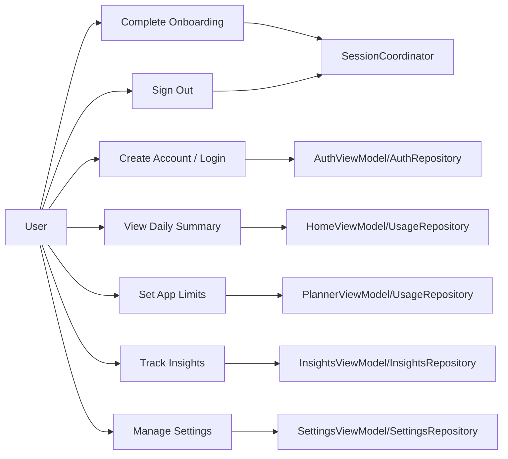

## 12) Container Diagram (App Runtime)
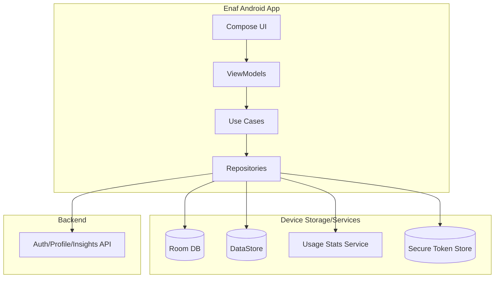

## 13) Sequence Diagram: Planner Save and Re-query
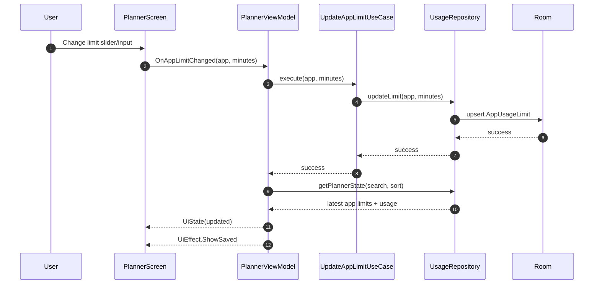

## 14) Sequence Diagram: Insights Refresh by Period
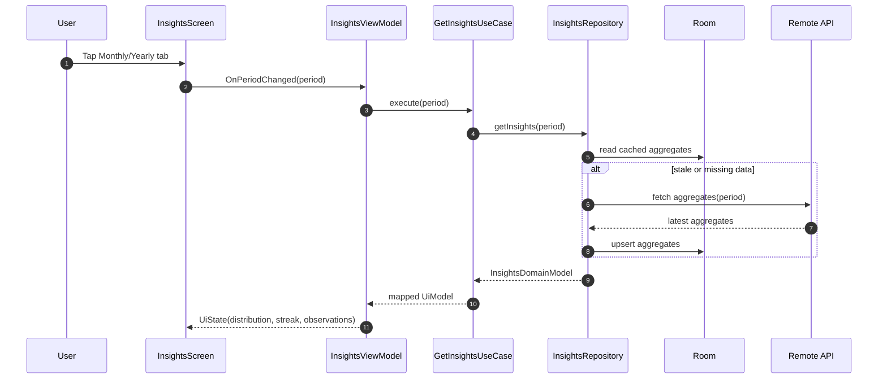

## 15) Activity Diagram: Error and Retry Pattern
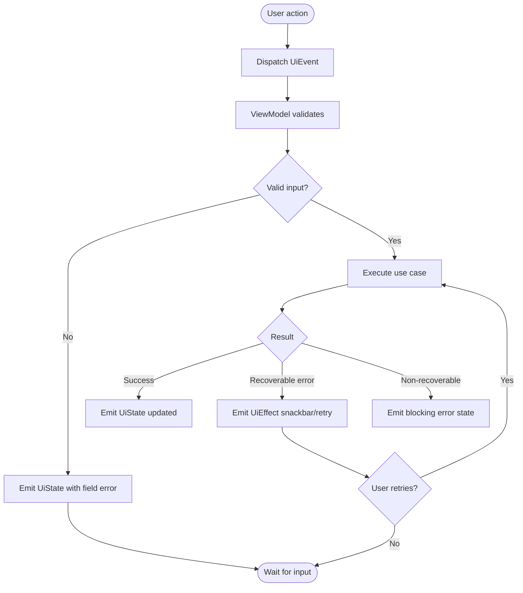

## 16) Activity Diagram: Data Freshness Lifecycle
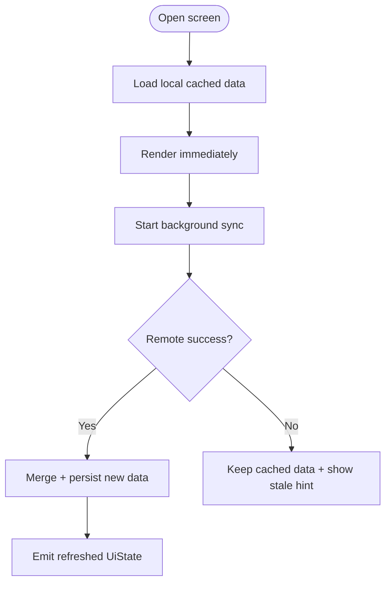

## 17) Implementation Mapping to Current File Structure
- Entry point and shell: `app/src/main/java/com/example/enaf/MainActivity.kt`
- Onboarding flow UI: `app/src/main/java/com/example/enaf/ui/screens/onboarding/OnboardingScreen.kt`
- Auth flow UI: `app/src/main/java/com/example/enaf/ui/screens/auth/AuthScreen.kt`
- Main tabs UI:
  - `app/src/main/java/com/example/enaf/ui/screens/home/HomeScreen.kt`
  - `app/src/main/java/com/example/enaf/ui/screens/planner/PlannerScreen.kt`
  - `app/src/main/java/com/example/enaf/ui/screens/insights/InsightsScreen.kt`
  - `app/src/main/java/com/example/enaf/ui/screens/settings/SettingsScreen.kt`
- Shared UI components: `app/src/main/java/com/example/enaf/ui/components/`
- Theme and design tokens: `app/src/main/java/com/example/enaf/ui/theme/`

## 18) Target Package Layout
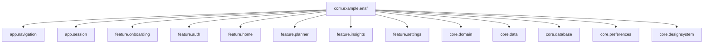

## 19) Definition of Done for Architecture Completion
- NavHost routes implemented for onboarding, auth, and main shell.
- All business state moved from `remember` to feature ViewModels.
- Repository contracts implemented with local-first behavior.
- Settings and session persistence wired to DataStore/token store.
- Planner/insights flows backed by real data source contracts.
- Unit, integration, and UI navigation tests passing in CI.

