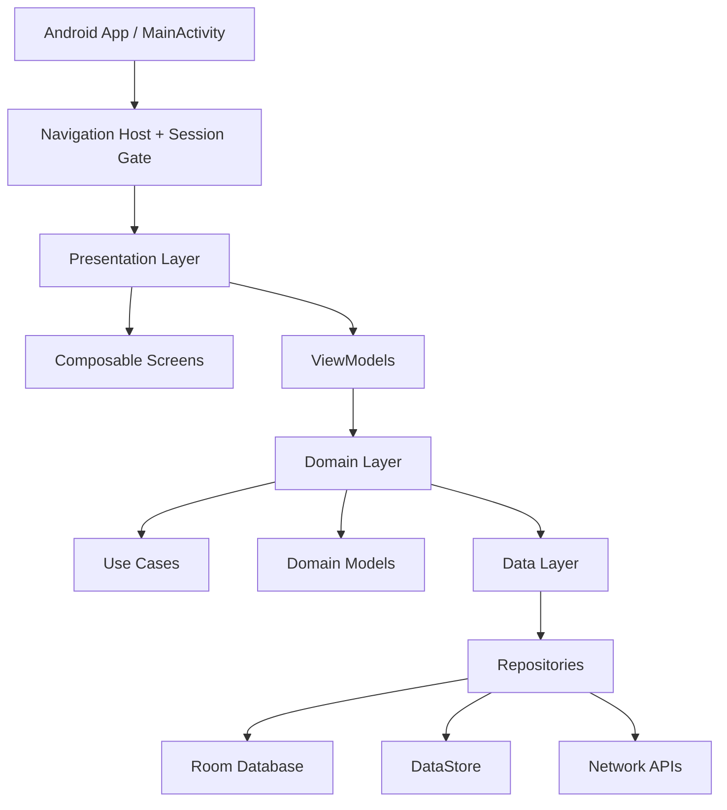
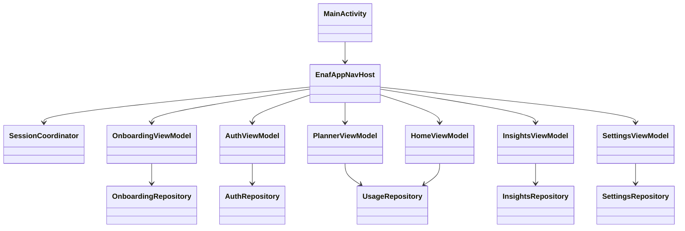

# Target State Overview

## Goals
- Move from UI-first prototype to layered architecture with clear state ownership.
- Keep Compose UI declarative and stateless where possible.
- Support onboarding, auth, planner limits, insights analytics, and settings persistence.

## Architecture Layers

## Module Boundaries (Single-module today, modular-ready contracts)

## Route Map (Target)
- Pre-auth: `onboarding`, `auth/login`, `auth/signup`.
- Post-auth shell: `home`, `planner`, `insights`, `settings`.
- Overlay/global: `times_up_modal`, `profile`, `notifications`.

## Delivery Phases
1. Add NavHost and session gate (onboarding/auth/main shell).
2. Introduce ViewModel per screen with `UiState` and `UiEvent`.
3. Add repositories + local persistence (Room/DataStore).
4. Connect analytics/insights and app usage data provider.
5. Add integration/UI tests for critical flows.

