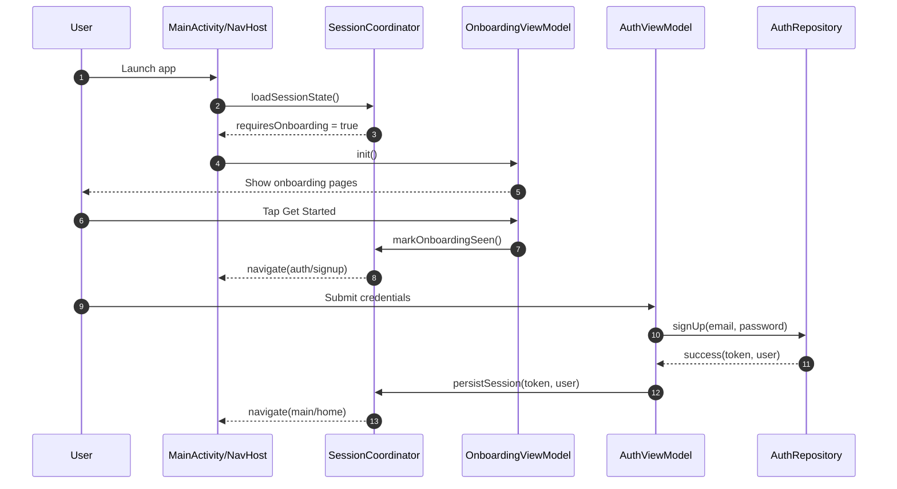
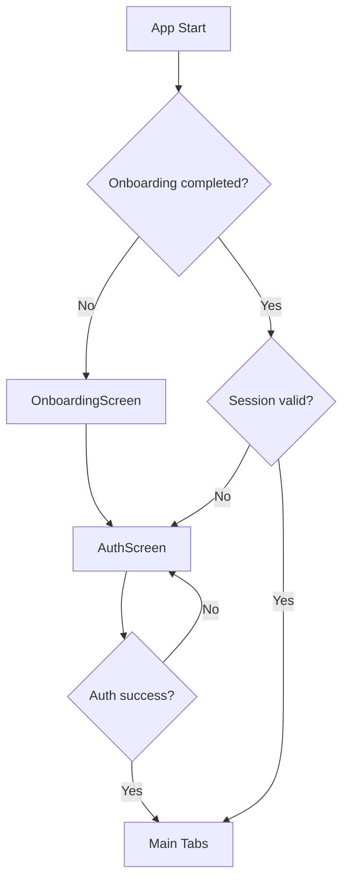

# Onboarding and Auth Flow (Target)

## End-to-End Journey

## Auth Decision Tree

## Contracts
- `SessionCoordinator` is the single source of truth for onboarding + auth session state.
- `OnboardingViewModel` emits one-time effects for navigation.
- `AuthViewModel` handles validation, loading, error mapping, and success effect.
- Screens do not call repositories directly.

## Failure Handling
- Invalid credentials: map to inline field errors.
- Network error: show retry + non-blocking snackbar.
- Expired session: clear token and return to `auth/login`.

