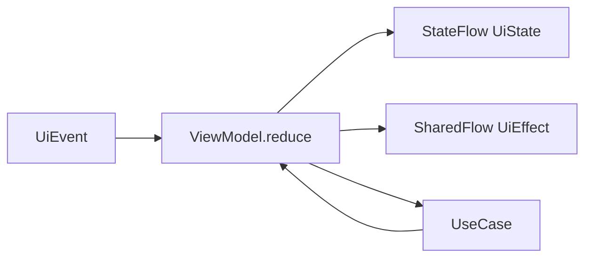
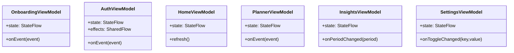

# ViewModel Design (Target)

## Standard Pattern
Each feature ViewModel follows this contract:
- `UiState`: persistent render state.
- `UiEvent`: user/system input.
- `UiEffect`: one-time side effects (navigation, snackbar).

## Target ViewModels

## Feature State Snapshot
- `OnboardingUiState`: `currentPage`, `isLastPage`, `canSkip`.
- `AuthUiState`: `mode`, `email`, `password`, `loading`, `fieldErrors`.
- `HomeUiState`: `dailySummary`, `habitUsage[]`, `motivationMessage`.
- `PlannerUiState`: `globalLimit`, `searchQuery`, `appLimits[]`, `sort`.
- `InsightsUiState`: `period`, `streak`, `categoryDistribution[]`, `observations[]`.
- `SettingsUiState`: `profile`, `toggles`, `quietModeHours`, `themeMode`.

## Migration from Current Compose State
- Move `remember` fields in screens into feature ViewModels.
- Keep visual-only transient UI state in Compose if not business-relevant.
- Replace hardcoded lists with repository-backed flows.

