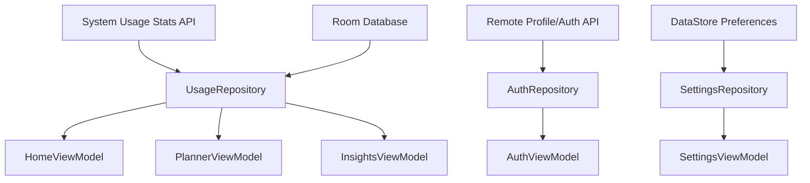
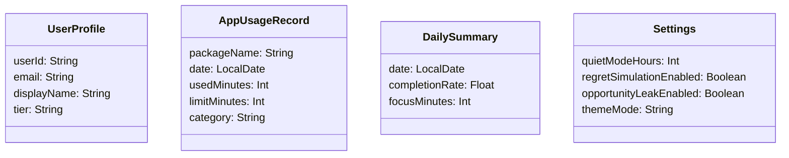

# Data and Storage Design (Target)

## Data Sources

## Core Entities

## Storage Responsibilities
- Room stores historical usage, streak snapshots, and aggregated analytics caches.
- DataStore stores user preferences, theme mode, onboarding completion, and lightweight flags.
- Auth token is stored securely (EncryptedSharedPreferences or platform-secure equivalent).

## Sync Strategy
- Pull latest usage summaries on app open and periodic refresh.
- Use local-first reads for UI speed; merge remote updates asynchronously.
- Keep deterministic conflict resolution: latest timestamp wins for mutable profile/preferences.

