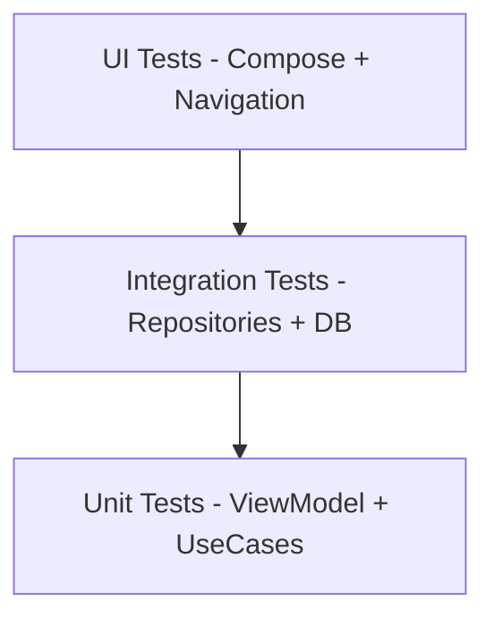

# Testing Strategy (Target)

## Test Pyramid

## Priority Scenarios
- App start routing: onboarding/auth/main tabs.
- Auth success/failure and error mapping.
- Planner search + limit update behavior.
- Insights period switching and chart data rendering.
- Settings persistence after process recreation.

## Per Layer
- Unit: reducers, validation, use case branching.
- Integration: Room queries, DataStore adapters, repository merge logic.
- UI: navigation transitions, visible state from fake ViewModels.

## CI Gate (Target)
- Run unit + integration tests on pull request.
- Run smoke Compose UI tests on main branch merge.
- Block release if app-start routing tests fail.

