# ENAF DATABASE DESIGN

## Recommended Stack

- On-device: Room over SQLite
- Preferences: DataStore
- Secure secrets: EncryptedSharedPreferences or Android Keystore-backed storage
- Backend: PostgreSQL
- API layer: REST first, GraphQL only if the client really needs it later

## Design Principles

- Keep the app local-first so the UI stays fast and usable offline.
- Store only the minimum on the device for privacy and battery reasons.
- Treat derived values like streaks, scores, and usage totals as computed data, not primary source data.
- Separate account data, usage data, rewards, and settings instead of bundling them into one profile record.

## Storage Split

### On-device tables

- `user_session`: cached auth/session state, onboarding status, active user id.
- `tracked_app`: apps the user has chosen to monitor.
- `app_limit`: per-app usage budget and current enforcement state.
- `usage_session`: foreground usage spans captured from system usage stats.
- `daily_summary`: precomputed daily aggregates for dashboard and insights.
- `wallet_ledger`: local cache of currency changes if needed for offline display.
- `achievement_cache`: unlocked badges and milestone state for fast rendering.
- `settings`: user preferences, theme, accessibility toggles, overlay settings.

### Backend tables

- `users`: authentication identity and account metadata.
- `profiles`: public profile data, display name, tier, xp.
- `tracked_apps`: synced app definitions if multi-device sync is enabled.
- `usage_summaries`: uploaded aggregates, not raw notification content.
- `wallets`: authoritative currency balance.
- `wallet_transactions`: immutable ledger of earned and spent currency.
- `achievements`: achievement definitions.
- `user_achievements`: join table for unlocked achievements.
- `shop_items`: purchasable rewards in the in-app shop.
- `purchases`: item purchase history.
- `leaderboard_snapshots`: cached rank materialized from score updates.

## Core Entities

### 1. User

Source of truth: backend

- `id`
- `email`
- `password_hash` or OAuth identity reference
- `auth_provider`
- `created_at`
- `last_login_at`

Notes:
- Never store plaintext passwords.
- If social login is used, store provider subject id instead of password.

### 2. Profile

Source of truth: backend, cached locally for display

- `id`
- `user_id`
- `display_name`
- `bio`
- `avatar_url`
- `xp`
- `level`
- `tier`
- `digital_health_score`
- `current_streak`
- `best_streak`

Notes:
- Do not store `apps[]` or `items[]` inside profile.
- Those are separate relations.

### 3. TrackedApp

Source of truth: local, optionally synced

- `id`
- `user_id`
- `package_name`
- `alias`
- `category`
- `is_blocked`
- `is_ignored`
- `created_at`

Notes:
- `package_name` should be unique per user.
- `alias` is the lore name shown in the UI.

### 4. AppLimit

Source of truth: local, optionally synced

- `id`
- `tracked_app_id`
- `daily_limit_minutes`
- `warning_threshold_minutes`
- `reset_policy`
- `is_active`
- `updated_at`

Notes:
- Keep limits separate from the app row because a user may change limits over time.

### 5. UsageSession

Source of truth: local

- `id`
- `tracked_app_id`
- `started_at`
- `ended_at`
- `duration_minutes`
- `source`
- `was_interrupted`

Notes:
- This is the atomic usage record.
- Dashboard totals and streaks should be derived from this table.

### 6. DailySummary

Source of truth: local cache, derived from usage sessions

- `id`
- `user_id`
- `date`
- `focus_minutes`
- `scroll_minutes`
- `time_saved_minutes`
- `completion_rate`
- `credit_score`
- `streak_day`

Notes:
- Store this as a cache so home and insights load fast.

### 7. Wallet

Source of truth: backend

- `id`
- `user_id`
- `coins_balance`
- `diamonds_balance`
- `updated_at`

Notes:
- Balance should be authoritative on the server.
- The client may cache it for display, but ledger entries should remain the real source.

### 8. WalletTransaction

Source of truth: backend

- `id`
- `wallet_id`
- `transaction_type`
- `amount`
- `reason`
- `reference_type`
- `reference_id`
- `created_at`

Notes:
- This table prevents balance bugs and makes reward logic auditable.

### 9. Achievement

Source of truth: backend

- `id`
- `code`
- `title`
- `description`
- `badge_icon_url`
- `criteria_type`
- `criteria_value`

### 10. UserAchievement

Source of truth: backend

- `id`
- `user_id`
- `achievement_id`
- `unlocked_at`

### 11. ShopItem

Source of truth: backend

- `id`
- `name`
- `description`
- `item_type`
- `price_coins`
- `price_diamonds`
- `is_active`

### 12. Purchase

Source of truth: backend

- `id`
- `user_id`
- `shop_item_id`
- `quantity`
- `total_cost`
- `purchased_at`

### 13. Settings

Source of truth: local, sync only if needed

- `id`
- `user_id`
- `allow_notifications`
- `allow_display_over_other_apps`
- `theme_mode`
- `preferred_theme`
- `biometric_lock_enabled`
- `overlay_enabled`
- `quiet_hours_start`
- `quiet_hours_end`

Notes:
- These are device preferences first, account preferences second.

### 14. Device

Source of truth: backend only if multi-device sync becomes important

- `id`
- `user_id`
- `device_name`
- `platform`
- `last_sync_at`
- `is_active`

Notes:
- You can postpone this until sync is actually needed.

### 15. AnalyticsEvent

Source of truth: local or backend aggregate, depending on use

- `id`
- `event_type`
- `event_time`
- `user_id`
- `metadata_json`

Notes:
- Do not store message content or notification content.
- Keep analytics minimal and privacy-safe.

## Relationships

- `User` 1:1 `Profile`
- `User` 1:1 `Wallet`
- `User` 1:N `TrackedApp`
- `TrackedApp` 1:N `AppLimit`
- `TrackedApp` 1:N `UsageSession`
- `User` 1:N `DailySummary`
- `User` 1:N `UserAchievement`
- `Achievement` 1:N `UserAchievement`
- `User` 1:N `Purchase`
- `ShopItem` 1:N `Purchase`
- `Wallet` 1:N `WalletTransaction`

## Entity-Relationship Diagram (Mermaid)

```mermaid
erDiagram
    %% LOCAL STORAGE (Room/DataStore)
    USER_SESSION ||--o| TRACKED_APP : ""
    TRACKED_APP ||--o{ APP_LIMIT : ""
    TRACKED_APP ||--o{ USAGE_SESSION : ""
    USER_SESSION ||--o{ DAILY_SUMMARY : ""
    USER_SESSION ||--o{ SETTINGS : ""
    USER_SESSION ||--o{ ACHIEVEMENT_CACHE : ""
    USER_SESSION ||--o{ WALLET_LEDGER : ""

    %% REMOTE STORAGE (PostgreSQL)
    USER ||--|| PROFILE : ""
    USER ||--|| WALLET : ""
    USER ||--o{ USER_ACHIEVEMENT : ""
    USER ||--o{ PURCHASE : ""
    ACHIEVEMENT ||--o{ USER_ACHIEVEMENT : ""
    SHOP_ITEM ||--o{ PURCHASE : ""
    WALLET ||--o{ WALLET_TRANSACTION : ""

    %% ENTITY DEFINITIONS - LOCAL (Room)
    USER_SESSION {
        string id PK
        string user_id
        string auth_token
        boolean onboarding_seen
        timestamp created_at
    }

    TRACKED_APP {
        string id PK
        string user_id FK
        string package_name UK
        string alias
        string category
        boolean is_blocked
        boolean is_ignored
        timestamp created_at
    }

    APP_LIMIT {
        string id PK
        string tracked_app_id FK
        int daily_limit_minutes
        int warning_threshold_minutes
        string reset_policy
        boolean is_active
        timestamp updated_at
    }

    USAGE_SESSION {
        string id PK
        string tracked_app_id FK
        timestamp started_at
        timestamp ended_at
        int duration_minutes
        string source
        boolean was_interrupted
    }

    DAILY_SUMMARY {
        string id PK
        string user_id FK
        date date UK
        int focus_minutes
        int scroll_minutes
        int time_saved_minutes
        float completion_rate
        int credit_score
        int streak_day
    }

    SETTINGS {
        string id PK
        string user_id FK
        boolean allow_notifications
        boolean allow_display_over_other_apps
        string theme_mode
        string preferred_theme
        boolean biometric_lock_enabled
        boolean overlay_enabled
        time quiet_hours_start
        time quiet_hours_end
    }

    ACHIEVEMENT_CACHE {
        string id PK
        string user_id FK
        string achievement_id FK
        timestamp unlocked_at
    }

    WALLET_LEDGER {
        string id PK
        string user_id FK
        int coins_balance_cache
        int diamonds_balance_cache
        timestamp updated_at
    }

    %% ENTITY DEFINITIONS - REMOTE (PostgreSQL)
    USER {
        string id PK
        string email UK
        string password_hash
        string auth_provider
        timestamp created_at
        timestamp last_login_at
    }

    PROFILE {
        string id PK
        string user_id FK
        string display_name
        string bio
        string avatar_url
        int xp
        int level
        string tier
        float digital_health_score
        int current_streak
        int best_streak
    }

    WALLET {
        string id PK
        string user_id FK
        int coins_balance
        int diamonds_balance
        timestamp updated_at
    }

    WALLET_TRANSACTION {
        string id PK
        string wallet_id FK
        string transaction_type
        int amount
        string reason
        string reference_type
        string reference_id
        timestamp created_at
    }

    ACHIEVEMENT {
        string id PK
        string code UK
        string title
        string description
        string badge_icon_url
        string criteria_type
        int criteria_value
    }

    USER_ACHIEVEMENT {
        string id PK
        string user_id FK
        string achievement_id FK
        timestamp unlocked_at
    }

    SHOP_ITEM {
        string id PK
        string name
        string description
        string item_type
        int price_coins
        int price_diamonds
        boolean is_active
    }

    PURCHASE {
        string id PK
        string user_id FK
        string shop_item_id FK
        int quantity
        int total_cost
        timestamp purchased_at
    }
```

## Normalized Schema View

### Local Room entities

- `TrackedAppEntity`
- `AppLimitEntity`
- `UsageSessionEntity`
- `DailySummaryEntity`
- `SettingsEntity`
- `AchievementCacheEntity`

### Remote PostgreSQL entities

- `UserEntity`
- `ProfileEntity`
- `WalletEntity`
- `WalletTransactionEntity`
- `AchievementEntity`
- `UserAchievementEntity`
- `ShopItemEntity`
- `PurchaseEntity`
- `LeaderboardSnapshotEntity`

## Data You Should Not Store

- Raw notification text
- Raw message content
- Passwords in plaintext
- Derived totals as the only record of truth
- Duplicate app metadata in multiple tables without a clear reason

## Updated Tech Stack Choice

1. SQLite + PostgreSQL
2. Room + DataStore + PostgreSQL

Preferred choice: Room + DataStore + PostgreSQL

Reason:
- It matches the Android app architecture.
- It keeps local usage tracking fast.
- It gives you strong relational consistency on the backend for rewards, profiles, and leaderboards.